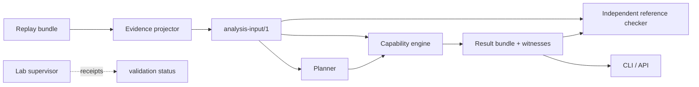

# AFTERLOCK

[](https://github.com/rakshit-737/afterlock/actions/workflows/ci.yml)
[](https://github.com/rakshit-737/afterlock/actions/workflows/live-lab.yml)
[](LICENSE)


AFTERLOCK is an open-source, evidence-backed **containment verifier** for Kubernetes
workload identities. It models permissions, previously acquired credentials,
attacker-controlled workloads, and credential lifecycles. From that model it
determines whether a proposed remediation removes attacker access, or only blocks
the way that access was first acquired.

**A permission was revoked. Prove the access is gone.**

> **Maturity:** research-grade, version 0.1.0. The replay engine, reference checker,
> planner, CLI, and API are implemented and tested. A live kind lab (Kubernetes v1.31.4)
> has confirmed the model on 11/11 semantic spike steps, including bound-token rejection
> after Pod deletion and downstream credential rotation. That is one version on one idle
> cluster; other rules remain model-level.
> See [docs/engineering/status.md](docs/engineering/status.md).

## The failure mode

A compromised CI service account can create Pods. The attacker creates a Pod that
runs as `release-reader`, obtains that Pod's projected token, and reads a protected
Secret. The responder removes the CI account's `ci-pod-creator` RoleBinding.

The original attack path is gone. **The attacker's Pod, and its token, are not.**
The copied downstream credential still works, too. Configuration closure is not containment.

```text
$ afterlock explain --latest
AFTERLOCK residual-token: Containment FAILS in the modeled state.
  model conclusion: residual_path   validation: not_executed
  remediation sequence:
    1. remove_binding(name=ci-pod-creator, namespace=demo)

Objective protect-secret [violated]
  witness (evidence_supported):
    - attacker possesses credential observed:pod-attacker-0001:…  [EVIDENCE, observed evidence=lab-audit#2]
    - attacker can read secret demo/release-credential  [R-READ-SECRET, after remediation step 1]
        credential usable: unexpired, API audience, service account UID and bound object present
        authorized: get secrets in demo via demo/release-reader-secret

Objective protect-canary [violated]
    - attacker knows secret demo/release-credential version 1  [EVIDENCE, observed evidence=lab-audit#2]
    - attacker can authenticate to canary-service  [R-USE-DOWNSTREAM, after remediation step 1]
```

The planner then searches for a sequence that contains the incident **and** keeps the
release workload running:

| Plan | Objectives | Release workload |
|---|---|---|
| Proposed: remove CI binding | ✗ residual token, ✗ copied credential | preserved |
| Naive: strip every attacker-associated binding and workload | ✗ copied credential | **broken** |
| Found (cost 6): remove CI binding → delete release-reader pods except `release-app` → rotate canary credential | ✓ within scope | preserved |

Order matters. Deleting the attacker Pod *before* removing the binding lets the
attacker recreate it between the two steps (see the `defender-race` case).

## Quick start (replay mode: Python 3.11 only, no cluster, no Docker)

```bash
git clone <repository-url> afterlock && cd afterlock
./scripts/bootstrap                       # creates .venv, installs afterlock (core has zero runtime deps)
. .venv/bin/activate
python scripts/doctor --profile replay

afterlock replay import datasets/replay/residual-token
afterlock analyze --case residual-token
afterlock explain --latest
afterlock verify --latest                 # independent reference checker
afterlock plan --case residual-token      # constrained containment search
afterlock analyze --case residual-token --remediation datasets/fixtures/targeted-plan.json
afterlock export --case residual-token --out /tmp/residual-token-export
```

`make demo` runs the same sequence. `./scripts/verify` runs lint, strict typing, all
tests, and the replay-reproducibility check.

## How it works

The engine evaluates a remediation **as a sequence**. Interval 0 is the environment at
analysis time, and interval *k* follows the *k*-th defender action. Between steps, the
attacker applies every supported transition; it does not pause while the defender works.

| State | Behavior |
|---|---|
| Authorization (RBAC) | Current state only; changes immediately with bindings |
| Credential possession | Survives removal of the permission that produced it |
| Credential usability | Not monotone: expiry, audience, SA UID, bound-Pod UID |
| Knowledge (e.g. a Secret's value) | Monotone: nothing makes it unknown again |
| Attacker workloads | Persist until deleted; controllers recreate them |

Every derived fact carries a provenance hyperedge: the rule, the conjunction of its
premises, and the environmental conditions checked. Results have two independent
dimensions: the **model conclusion** (`residual_path` · `contained_within_scope` ·
`unknown` · `invalid_input`) and the **validation status** (`not_executed` · `lab_confirmed`
· `lab_contradicted` · `validation_inconclusive`).

Missing evidence, unsupported admission webhooks, unsupported credential types, stale
collectors, rejected records, and exhausted search bounds produce **`unknown`**, never
containment.



See [docs/architecture/system.md](docs/architecture/system.md) and
[docs/semantics/supported.md](docs/semantics/supported.md).

## Supported semantics (profile `k8s-1.31-core-v1`, conformance **unverified**)

RBAC Roles/ClusterRoles/bindings (User, ServiceAccount, and SA group subjects;
`resourceNames`) · projected service-account tokens (expiry, audience, SA UID,
bound-Pod UID) · Pod creation, Deployment creation with controller reconciliation,
`pods/exec` · Secret reads · downstream credentials derived from Secrets, and their
rotation · `service-account-restriction` admission (a CEL ValidatingAdmissionPolicy in the
lab). Everything else is reported as unsupported.

## Evaluation

The benchmark is `python benchmarks/run.py`. It uses 16 hand-authored cases with expected
outcomes written from scenario descriptions. **These labels are not lab-validated.**

| Mode | False containment claims | Residual recall |
|---|---|---|
| full AFTERLOCK | 0 / 6 claims | 8/8 |
| snapshot-only (discard history) | 5 / 11 claims | 3/8 |
| final-state-only (no interleaving) | 1 / 7 claims | 7/8 |
| history without lifecycle | 0 / 1 claims | 8/8, but over-reports after expiry and binding changes |

The corpus was written by the same authors as the engine, so full agreement is expected
and **not** evidence of real-world accuracy. The independent checks that do carry weight
are these:
- Hypothesis-generated differential tests against the separately written reference checker.
- Witness replay.
- A mutation suite. Removing the bound-Pod, expiry, or audience checks, or treating
  unsupported admission as allow, is caught every time.

Real-cluster labels are the next milestone.

## Live lab

`scripts/lab create && scripts/lab spike && scripts/lab destroy` runs the Kubernetes
semantic spike. You need a **disposable** Docker-capable Linux host with `kind` and
`kubectl`. The spike records receipts that compare each real API outcome with the
engine's prediction. It can also run as the manual `live-lab` GitHub workflow. It has
**not** been run yet. See [docs/tutorials/live-lab.md](docs/tutorials/live-lab.md).

## Security model

- Read-only everywhere except the lab supervisor, which is pinned to a recorded lab identity.
- No tokens or Secret bodies are stored. Records that look like credentials are rejected.
- Per-cluster authorization is enforced in the API, not the UI.

See [SECURITY.md](SECURITY.md) and [docs/threat_model/threat-model.md](docs/threat_model/threat-model.md).

## Limitations

AFTERLOCK cannot establish that no credential was copied. It cannot un-disclose data.
It covers only declared objectives and the supported profile. It assumes control-plane
changes propagate before the next step, which is a lab-testable assumption. It excludes
node, host, and control-plane compromise. It never applies remediation to real clusters.
Result bundles repeat the relevant limitations.

## Prior art

KubeHound, BloodHound, PMapper, Cartography, Stratus Red Team, Kyverno, and MulVAL
cover attack graphs, identity analysis, policy enforcement, and emulation. AFTERLOCK does
not claim any of these ideas. Its intended contribution is a bounded combination:
history-aware residual-capability modeling, remediation-sequence search, independently
checkable explanations, and reproducible execution tests. See
[docs/research/prior-art.md](docs/research/prior-art.md).

## Development

[AGENTS.md](AGENTS.md) · [CONTRIBUTING.md](CONTRIBUTING.md) ·
[docs/engineering/status.md](docs/engineering/status.md) ·
[docs/engineering/verification.md](docs/engineering/verification.md)

## License

Apache-2.0. See [LICENSE](LICENSE).
