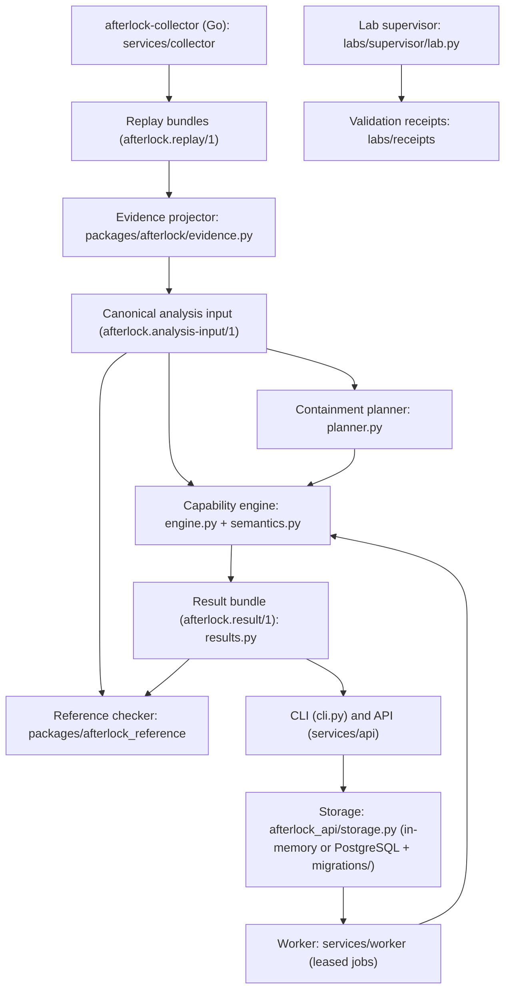

# System architecture

A modular monolith with separate trust-sensitive processes (ADR 0001). This page
describes what exists **now**. Planned components are marked as such.

## Components

| Component | Location | Status | Imports allowed |
|---|---|---|---|
| Domain model | `packages/afterlock/model.py` | implemented | stdlib |
| Semantics (RBAC, tokens, admission, defender actions) | `packages/afterlock/semantics.py` | implemented | model |
| Capability engine | `packages/afterlock/engine.py` | implemented | model, semantics |
| Result assembly and explanation | `packages/afterlock/results.py` | implemented | engine, model |
| Planner | `packages/afterlock/planner.py` | implemented | results, model |
| Evidence projector / replay | `packages/afterlock/evidence.py` | implemented | model |
| Reference checker | `packages/afterlock_reference` | implemented | stdlib only (**never** `afterlock`) |
| CLI | `packages/afterlock/cli.py` | implemented | all of the above |
| API | `services/api/afterlock_api` | implemented; in-memory or PostgreSQL storage | afterlock, fastapi, pydantic, psycopg (storage.py/migrate.py only) |
| Lab supervisor | `labs/supervisor/lab.py` | implemented; executed in the `live-lab` workflow (receipts in `labs/receipts/`) | kind, kubectl, afterlock (for predictions) |
| Storage + migrations | `services/api/afterlock_api/{storage,migrate}.py`, `migrations/` | implemented; PostgreSQL path tested only in CI `postgres` job | psycopg 3 (optional extra `postgres`) |
| Worker / PostgreSQL job queue | `services/worker/afterlock_worker` | implemented | afterlock, afterlock_reference, afterlock_api.storage |
| Go metadata collector | `services/collector` | implemented; lab-confirmed for two cases (`labs/receipts/collect-*.json`) | client-go (separate Go module) |
| Investigation frontend | `services/web` | implemented (React/Vite/TypeScript) | talks to the API over HTTP only |

`tests/security/test_redaction_and_boundaries.py` enforces the dependency direction.
The domain modules cannot import adapter libraries, and the reference checker cannot
import the engine.

## Data flow

1. **Receive.** A replay bundle directory is loaded. Each file's SHA-256 must match
   `manifest.json`. Symlinks, oversized files, and unknown schema versions are rejected.
2. **Normalize.** Every envelope is validated. Records with forbidden keys (`token`,
   `data`, `authorization`, …), credential-like values (JWT shapes, private keys, seeded
   canaries), excessive nesting or length, or a mismatched cluster are **rejected**. Each
   rejection becomes a coverage gap.
3. **Deduplicate.** Records are keyed by `(source_id, source_sequence)`. Identical
   repeats are counted. Conflicting repeats become coverage gaps. Order is canonical and
   does not depend on delivery order. Kubernetes `resourceVersion` is never compared.
4. **Project.**
   - Attribution is a fixpoint. A request from an actor whose token is bound to an
     attacker-controlled Pod UID is attacker activity.
   - Successful attacker requests become `observed` facts. The seeded compromise is
     `assumed`.
   - Pods that no longer exist become `historical_pod` facts.
   - Unresolved `collector.gap` records and missing heartbeats become coverage gaps.
5. **Analyze.** Two views run over the same input:
   - *evidence-supported*: observed and assumed facts only;
   - *conservative-possible*: adds inferred facts and a possible-history phase. In that
     phase, historically controlled Pods (including deleted ones) may have been used for
     any supported action. Objects created there are discarded; knowledge, credentials,
     and control of Pods that still exist carry forward.

   Each view walks the remediation sequence and computes the attacker fixpoint in every
   interval.
6. **Conclude.** For each objective:
   - `violated` means a goal was reached in the evidence view;
   - `possibly_violated` means it was reached only in the possible view;
   - `unknown` means gaps, unsupported semantics, or bounds exceeded;
   - otherwise `satisfied_within_scope`.
7. **Verify.** The reference checker replays witnesses and independently explores all
   interleavings. The lab records validation receipts.

## Persistence and job execution

Selected by `AFTERLOCK_DATABASE_URL`: unset means `MemoryStorage` (per process, lost on
restart); set means `PostgresStorage` (psycopg 3). `GET /v1/health` reports which
(`in-memory` or `postgresql`). The domain packages never import storage code.

**Schema.** `migrations/NNNN_name.sql` are plain SQL, applied in order by
`python -m afterlock_api.migrate`. The runner records `(version, name, checksum)` in
`schema_migrations`. It refuses a gap in numbering, an applied migration whose file
changed, and an applied version missing from the release. Each migration and its record
commit together. The API and worker refuse to start on an older schema.

| Table | Contents | Mutability |
|---|---|---|
| `cases` | sanitized projected input, diagnostics, `content_hash` | immutable (UPDATE/DELETE trigger) |
| `analysis_manifests` | content-addressed `(cluster, case, kind, engine_version, payload)`; `input_hash`, semantic profile | immutable |
| `jobs` | state, `lease_owner`, `lease_expires_at`, `heartbeat_at`, `attempts`/`max_attempts`, `cancel_requested`, `last_error` | state machine below |
| `results` | versioned result; `UNIQUE (job_id)` | immutable |

Every row has `cluster_id`. Every API query filters on the caller's clusters, and every
worker write names both `job_id` and `cluster_id`. All SQL is parameterized. No token or
Secret value is stored; cases hold only the sanitized projection. Because deletes are
refused, retention cannot silently remove evidence that a published result references.
No retention job exists yet.

**Jobs.** `queued → leased → running → succeeded | failed | cancelled`. A worker claims the
oldest claimable job with `SELECT … FOR UPDATE SKIP LOCKED`. Claimable means queued, or
leased/running with an expired lease. The claim increments `attempts`; once the retry
budget is spent, an expired job becomes `failed`. Before running, the worker recomputes
the manifest hash. While the pure engine runs, a heartbeat thread extends the lease.
Cancelling a queued job is immediate. For a leased or running job, cancellation sets
`cancel_requested`; the worker sees it on its next heartbeat and acknowledges. The engine
call itself is not interruptible, so a cancelled job may keep computing until it
finishes, and its result is then discarded.

**Publication invariant.** A result is inserted only inside one transaction that:
1. locks the job row;
2. checks that the caller holds an unexpired lease and no cancellation was requested;
3. joins the job's manifest and case rows (committed with the job at enqueue, so no job
   exists without its full input);
4. marks the job `succeeded`.

`UNIQUE (job_id)` makes a duplicate completion a no-op. A worker whose lease expired
cannot publish; another worker re-runs the job from the same immutable manifest.

**In-memory mode** has no separate worker. The API runs queued jobs in-process after the
response (FastAPI background task), using the same claim/complete protocol.

## Why a fixpoint equals interleaving

Every supported attacker transition only *adds* attacker capability or objects. Between
two defender steps, the join of all attacker interleavings is therefore the fixpoint of
single steps. One subtlety is that the attacker can create workloads without limit. The
engine keeps one live model-created workload per (namespace, service account). That is
sound because defender actions cannot address model-created objects individually (their
UID prefixes are reserved), and selector-based deletions treat them all alike. The
reference checker does **not** rely on this argument. It explores explicit interleavings
with up to two live attacker workloads per service account, and the differential tests
compare the two (ADR 0004).

## Failure handling (implemented subset)

| Failure | Behavior |
|---|---|
| Corrupted bundle | `invalid_input` |
| Malformed or credential-bearing record | rejected, coverage gap, conclusion at best `unknown` |
| Duplicate delivery | counted, no effect |
| Conflicting duplicate | coverage gap |
| Collector gap / stale heartbeat | coverage gap |
| Derivation cap reached | `unknown`, scope says exploration incomplete |
| Planner evaluation cap | `incomplete_search`, never "no plan exists" |
| Worker crash / stall | lease expires; job re-run from its immutable manifest (bounded by `max_attempts`); stale worker cannot publish |
| Duplicate completion | ignored (`UNIQUE (job_id)` + lease check) |
| Crash during publication | transaction rolls back; no partial result; job re-claimable after lease expiry |
| Edited or unknown applied migration | migration runner refuses to proceed |
