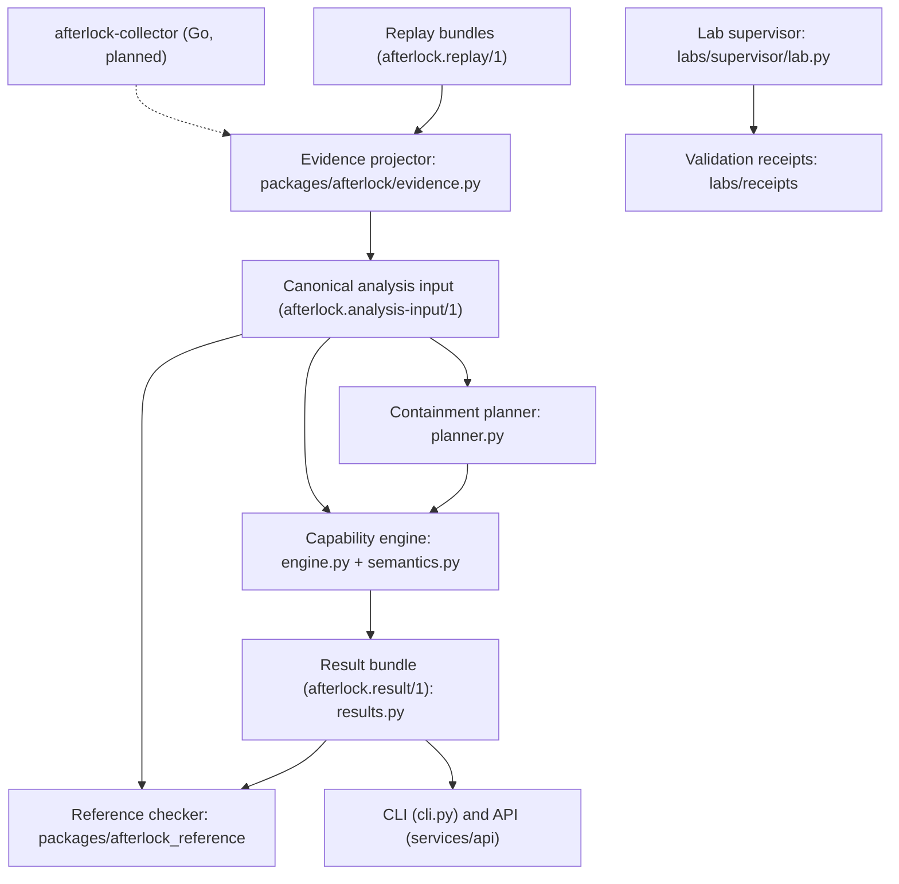

# System architecture

A modular monolith with separate trust-sensitive processes (ADR 0001). This page
describes what exists **now**. Planned components are marked as such.

## Components

| Component | Location | Status | Imports allowed |
|---|---|---|---|
| Domain model | `packages/afterlock/model.py` | implemented | stdlib |
| Semantics (RBAC, tokens, admission, defender actions) | `packages/afterlock/semantics.py` | implemented | model |
| Capability engine | `packages/afterlock/engine.py` | implemented | model, semantics |
| Result assembly and explanation | `packages/afterlock/results.py` | implemented | engine, model |
| Planner | `packages/afterlock/planner.py` | implemented | results, model |
| Evidence projector / replay | `packages/afterlock/evidence.py` | implemented | model |
| Reference checker | `packages/afterlock_reference` | implemented | stdlib only (**never** `afterlock`) |
| CLI | `packages/afterlock/cli.py` | implemented | all of the above |
| API | `services/api/afterlock_api` | implemented, in-memory storage | afterlock, fastapi, pydantic |
| Lab supervisor | `labs/supervisor/lab.py` | written, **not executed** | kind, kubectl, afterlock (for predictions) |
| Worker / PostgreSQL job queue | `services/worker`, `migrations/` | planned | — |
| Go metadata collector | `services/collector` | planned | — |
| Investigation frontend | `web/` | planned | — |

`tests/security/test_redaction_and_boundaries.py` enforces the dependency direction.
The domain modules cannot import adapter libraries, and the reference checker cannot
import the engine.

## Data flow

1. **Receive.** A replay bundle directory is loaded. Each file's SHA-256 must match
   `manifest.json`. Symlinks, oversized files, and unknown schema versions are rejected.
2. **Normalize.** Every envelope is validated. Records with forbidden keys (`token`,
   `data`, `authorization`, …), credential-like values (JWT shapes, private keys, seeded
   canaries), excessive nesting or length, or a mismatched cluster are **rejected**. Each
   rejection becomes a coverage gap.
3. **Deduplicate.** Records are keyed by `(source_id, source_sequence)`. Identical
   repeats are counted. Conflicting repeats become coverage gaps. Order is canonical and
   does not depend on delivery order. Kubernetes `resourceVersion` is never compared.
4. **Project.**
   - Attribution is a fixpoint. A request from an actor whose token is bound to an
     attacker-controlled Pod UID is attacker activity.
   - Successful attacker requests become `observed` facts. The seeded compromise is
     `assumed`.
   - Pods that no longer exist become `historical_pod` facts.
   - Unresolved `collector.gap` records and missing heartbeats become coverage gaps.
5. **Analyze.** Two views run over the same input:
   - *evidence-supported*: observed and assumed facts only;
   - *conservative-possible*: adds inferred facts and a possible-history phase. In that
     phase, historically controlled Pods (including deleted ones) may have been used for
     any supported action. Objects created there are discarded; knowledge, credentials,
     and control of Pods that still exist carry forward.

   Each view walks the remediation sequence and computes the attacker fixpoint in every
   interval.
6. **Conclude.** For each objective:
   - `violated` means a goal was reached in the evidence view;
   - `possibly_violated` means it was reached only in the possible view;
   - `unknown` means gaps, unsupported semantics, or bounds exceeded;
   - otherwise `satisfied_within_scope`.
7. **Verify.** The reference checker replays witnesses and independently explores all
   interleavings. The lab records validation receipts.

## Why a fixpoint equals interleaving

Every supported attacker transition only *adds* attacker capability or objects. Between
two defender steps, the join of all attacker interleavings is therefore the fixpoint of
single steps. One subtlety is that the attacker can create workloads without limit. The
engine keeps one live model-created workload per (namespace, service account). That is
sound because defender actions cannot address model-created objects individually (their
UID prefixes are reserved), and selector-based deletions treat them all alike. The
reference checker does **not** rely on this argument. It explores explicit interleavings
with up to two live attacker workloads per service account, and the differential tests
compare the two (ADR 0004).

## Failure handling (implemented subset)

| Failure | Behavior |
|---|---|
| Corrupted bundle | `invalid_input` |
| Malformed or credential-bearing record | rejected, coverage gap, conclusion at best `unknown` |
| Duplicate delivery | counted, no effect |
| Conflicting duplicate | coverage gap |
| Collector gap / stale heartbeat | coverage gap |
| Derivation cap reached | `unknown`, scope says exploration incomplete |
| Planner evaluation cap | `incomplete_search`, never "no plan exists" |
