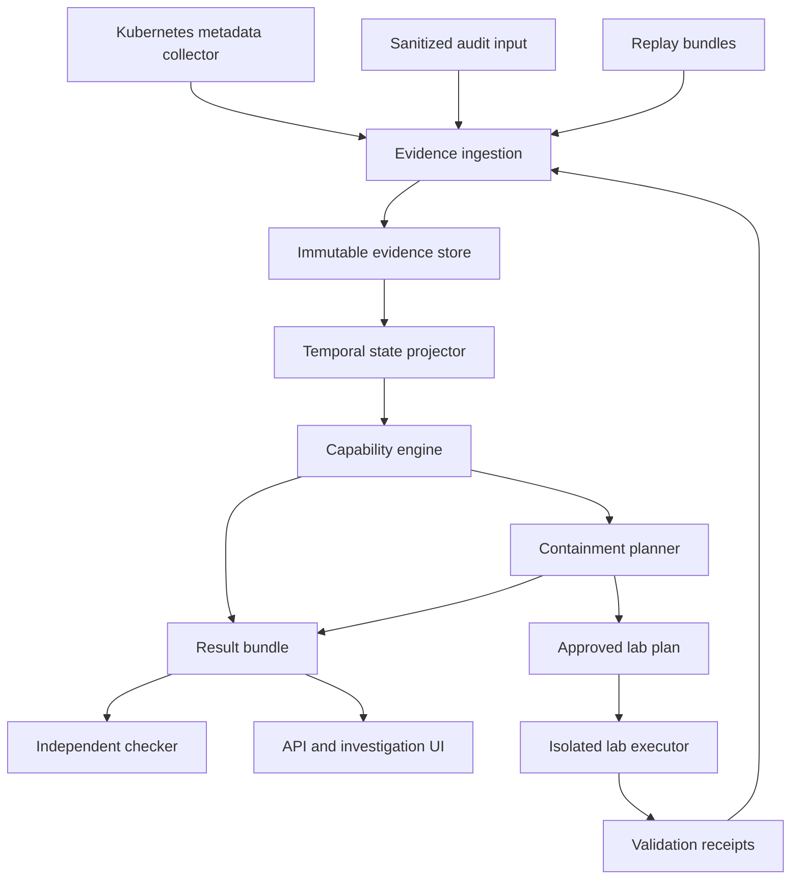

I’ll focus on a system with a testable security claim, not a broad collection of tools. I’ll compare it with relevant open-source projects and separate what it can prove from what it can only infer.

---

KubeHound already covers Kubernetes attack-path calculation, so “another Kubernetes attack graph” does not survive the comparison.

The stronger project is a containment verifier: it determines whether a proposed fix actually removes access when an attacker may already have created workloads, obtained delegated credentials, or copied data. Its key test is a fix that closes the configuration-level path but leaves an earlier credential usable.

---

# AFTERLOCK

## Tagline

**A permission was revoked. Prove the access is gone.**

## One-Sentence Concept

AFTERLOCK is an open-source, evidence-backed containment verifier that models Kubernetes permissions, previously acquired credentials, attacker-controlled workloads, and credential lifetimes to determine whether a proposed remediation actually removes access—and then tests that conclusion in an isolated laboratory.

**The flagship demonstration:** removing the permission that enabled an attack does not remove the capabilities the attacker already acquired.

The engine explains why, proposes a containment sequence, checks its operational constraints, and verifies the result against a real Kubernetes API.

---

## The Problem

Security tools are good at answering:

> “What can this identity do with the permissions it has now?”

Incident responders need a harder answer:

> “What can this attacker still do after everything they might already have done?”

Those are different questions.

Consider a compromised CI service account that can create Pods in a namespace. Subject to admission controls, that permission can let it create a workload using another service account in the same namespace.

The new workload receives its own projected service-account token. That identity may have permissions the CI identity never had directly.

An administrator removes the CI identity’s Pod-creation permission.

The original configuration-level attack path disappears.

**The attacker-created Pod—and its delegated identity—may remain usable.**

Even deleting that Pod does not undo information already obtained through it. A copied downstream credential needs separate revocation or rotation at its relying service.

The problem is not simply finding an attack path. It is reasoning about **security state that survives the removal of the path that created it**.

AFTERLOCK focuses on the intersection of:

| Area | Why it matters |
|---|---|
| Kubernetes authorization | Defines what identities can request now. |
| Workload identity | Workloads can acquire credentials with independent lifetimes and bindings. |
| Incident response | Responders need to distinguish blocking new access from eliminating existing access. |
| Temporal security modeling | Acquired capabilities can outlive the permissions that produced them. |
| Formal methods | Containment claims require explicit assumptions, state transitions, and counterexamples. |
| Detection engineering | Evidence establishes which transitions occurred and where uncertainty remains. |
| Cyber resilience | A useful fix must preserve declared legitimate operations where possible. |

This is not a scanner, SIEM, honeypot, anomaly detector, AI assistant, or collection of tools behind a dashboard.

**It is a narrow security reasoning system with an executable validation laboratory.**

---

## Why This Problem Matters

Containment is frequently evaluated as a configuration change:

> “We removed the role binding.”

But the security objective is behavioral:

> “The attacker can no longer access the protected resource.”

A configuration change is evidence toward that objective, not proof of it.

| User | Practical question AFTERLOCK addresses |
|---|---|
| Incident responder | Did our intervention remove access, or only prevent one way of acquiring it? |
| Kubernetes platform engineer | Which containment sequence preserves the release service while removing attacker access? |
| Security engineer | Which assumptions make this remediation valid? |
| Detection engineer | What evidence is missing before we can call this incident contained? |
| Researcher | How often do snapshot-based analyses incorrectly conclude that a remediation is sufficient? |
| Infrastructure reviewer | What residual capabilities would remain if this security change were applied after compromise? |

The important outcome is not a higher risk score.

It is a result such as:

> **Containment fails in the modeled state.**  
> Removing `ci-pod-creator` prevents additional Pod creation, but Pod UID `…` still supports a valid credential for `release-reader`. That identity can read the protected Secret.  
>   
> **Evidence:** successful Pod creation, observed Pod identity, relevant authorization rules, and a lab validation receipt.  
>   
> **Additional consequence:** a successful earlier Secret read means downstream credential rotation remains necessary even after Kubernetes access is removed.

That is an engineering conclusion someone can investigate and challenge.

---

## Existing Solutions

I checked public repository descriptions and README material for the principal overlaps. This is a targeted comparison, **not an exhaustive literature review or a claim that commercial products lack similar capabilities**.

| Existing project | Relevant capability | Relationship to AFTERLOCK |
|---|---|---|
| [KubeHound](https://github.com/DataDog/KubeHound) | Builds Kubernetes attack graphs and calculates paths between cluster assets. | The closest overlap. AFTERLOCK must not position Kubernetes attack-path discovery as its invention. |
| [BloodHound](https://github.com/SpecterOps/BloodHound) | Analyzes identity and privilege relationships; OpenGraph extends its modeling beyond its original identity environments. | Establishes the value of identity graphs. AFTERLOCK concentrates on residual capabilities and containment validation. |
| [PMapper](https://github.com/nccgroup/PMapper) | Models AWS IAM identities and privilege escalation, including indirect access through other identities. | Demonstrates that delegated access and authorization simulation are established concepts. |
| [Cartography](https://github.com/cartography-cncf/cartography) | Collects infrastructure assets and relationships into a graph across many platforms. | A potential future source of inventory, not a substitute for temporal containment semantics. |
| [Stratus Red Team](https://github.com/DataDog/stratus-red-team) | Provides granular, self-contained cloud adversary emulation. | Relevant precedent for reproducible security scenarios. AFTERLOCK adds model-versus-execution containment evaluation. |
| [Kyverno](https://github.com/kyverno/kyverno) | Enforces Kubernetes policies through admission controls and other resource-management workflows. | A control the system can model or validate against; policy enforcement alone does not establish that previously acquired access is gone. |
| [MulVAL](https://github.com/risksense/mulval) | Uses logic-based analysis to generate attack graphs. | Important prior art for declarative attack reasoning. The rule-based part of AFTERLOCK is not novel by itself. |

Kubernetes’s own documentation is a primary semantic reference:

| Reference | What it anchors |
|---|---|
| [Service account administration](https://kubernetes.io/docs/reference/access-authn-authz/service-accounts-admin/) | Bound-token validation, object bindings, deletion behavior, and credential lifecycle. |
| [RBAC authorization](https://kubernetes.io/docs/reference/access-authn-authz/rbac/) | Authorization semantics and restrictions around privilege escalation and role binding. |

**Important implementation detail:** Kubernetes documents bound-object existence and UID checks, as well as behavior for objects pending deletion. AFTERLOCK must test these semantics against its pinned Kubernetes versions rather than hard-code “deleting a Pod instantly revokes everything.”

### The honest differentiation

The reviewed documentation establishes substantial overlap in attack graphs, identity analysis, policy enforcement, and adversary emulation.

What AFTERLOCK should contribute is their carefully bounded combination:

> **History-aware residual-capability modeling + remediation-sequence search + independently checkable explanations + reproducible execution tests.**

Whether that combination constitutes publishable research depends on a broader literature review and the evaluation results.

The repository remains valuable even if similar research exists.

---

## Existing Gaps

| Gap | Why existing building blocks do not automatically close it |
|---|---|
| Permissions and acquired capabilities are different state | An authorization edge can disappear while an issued credential or attacker-created workload remains. |
| Remediation changes the future, not the past | Preventing another Secret read does not make a previously copied credential unknown. |
| Ordering changes containment | Deleting a workload before blocking its recreation can leave a race or a surviving replacement. |
| Evidence is incomplete | An absent audit event is not proof that a credential was never obtained. |
| Authorization is not the whole execution environment | Admission, credential validation, object bindings, and service behavior affect whether a path works. |
| “No path found” is ambiguous | It may mean no path exists, search limits were reached, semantics are unsupported, or telemetry is incomplete. |
| Research evaluations can be circular | A model should not generate its own scenarios and then treat agreement with those same rules as independent validation. |
| Fixes have operational costs | Removing every permission may stop the attack while also stopping the organization. |

AFTERLOCK should treat these as architectural requirements, not README caveats added later.

---

## Our Approach

Build a **temporal capability engine**, not a general-purpose security graph platform.

The engine maintains two related models:

| Model | Meaning |
|---|---|
| Environmental state | Current identities, permissions, workloads, object lifecycles, and supported policy controls. |
| Attacker state | Credentials the attacker possesses or may possess, controlled workloads, acquired information, and capabilities derived from prior actions. |

A remediation changes one or both models.

For example:

| Intervention | Environmental effect | Attacker-state effect |
|---|---|---|
| Remove CI Pod-creation permission | Blocks future authorized creation through that identity. | Does not erase an already created Pod or copied token. |
| Delete the attacker-created Pod | Removes the workload and affects validation of its bound tokens. | Does not erase information already learned. |
| Remove the delegated identity’s Secret-read permission | Changes authorization for subsequent API requests. | May block new reads, but not use of previously copied downstream credentials. |
| Rotate a credential at its relying service | Changes which credential that service accepts. | Makes the copied old credential ineffective there once rotation is effective. |

The engine then asks:

> Given this evidence, these explicitly supported semantics, these possible attacker states, and this analysis horizon, does a successful attacker continuation remain?

If yes, it returns a witness.

If no, it returns a scope-limited containment result with its assumptions.

If it cannot decide reliably, it returns **unknown**, not green.

---

## Core Technical Innovation

### 1. Capabilities retain their acquisition history

A capability records what produced it.

```text
Capability
  subject
  operation
  resource scope
  acquisition transition
  supporting evidence
  credential dependency
  object-binding dependency
  effective interval
  invalidation conditions
  epistemic status
```

This permits an explanation such as:

> “Removing the permission that created this capability does not invalidate the capability itself.”

The acquisition edge and the continuing-validity conditions are deliberately separate.

### 2. Attacker knowledge is not treated like an RBAC edge

If a supported observation establishes that a successful API read returned a sensitive credential, the model records the acquisition of that information.

Later RBAC changes cannot delete that fact.

However, the credential’s usefulness can change.

Formally:

$$
K_t \subseteq K_{t+1}
$$

where $K_t$ is attacker knowledge.

But:

$$
\operatorname{Usable}(c,t)
$$

can become false after expiration, revocation, or a relying-service change.

**Knowing an old credential and being able to use it are different properties.**

### 3. Containment is checked as a sequence

The engine evaluates interventions in order, with supported attacker actions interleaved between them.

It distinguishes:

```text
Delete attacker Pod
then remove creation permission
```

from:

```text
Remove creation permission
confirm the relevant authorization change
then delete attacker Pod
```

Neither sequence receives a universal guarantee. The result depends on the modeled alternative permissions, acquired credentials, propagation assumptions, and available evidence.

### 4. Conclusions carry checkable evidence

Each result contains:

| Field | Purpose |
|---|---|
| Input digest | Identifies the exact replay bundle. |
| Semantic profile | Identifies the supported Kubernetes and rule semantics. |
| Assumptions | Makes unobserved starting conditions explicit. |
| Evidence references | Connects statements to collected records. |
| Analysis bounds | States horizon, transition depth, and object limits. |
| Witness or closure summary | Explains the result. |
| Missing coverage | Prevents unsupported areas from disappearing from the conclusion. |
| Validation receipts | Separately records what was actually tested in the lab. |

For small projected states, a separate reference checker recomputes the result.

A checksum proves neither completeness nor truth. It only identifies content. The project must say that explicitly.

### 5. The system validates its semantic model against reality

A finding is not promoted from “model-reachable” to “lab-validated” because its graph looks plausible.

The laboratory executes a bounded, allowlisted scenario against a real Kubernetes API and checks whether the predicted request succeeds.

**The experiment can falsify the engine.**

That is the strongest part of the project.

---

## Central Research Question

> **Under what explicit assumptions can a history-aware capability model distinguish effective containment from configuration-only remediation, and produce low-disruption intervention sequences whose predicted effects agree with controlled Kubernetes execution?**

### Hypothesis

For the supported scenario families, retaining acquired capabilities and credential-lifecycle semantics will reduce **false containment claims** compared with snapshot-only analysis.

Searching intervention sequences while preserving legitimate-operation constraints will produce less disruptive valid plans than indiscriminate identity revocation.

These are hypotheses, not results.

### Methodology

| Element | Definition |
|---|---|
| Unit of analysis | An incident state followed by a candidate remediation sequence. |
| Ground truth | Independent lab execution outcomes plus scenario-owned expected properties. |
| Main comparison | Snapshot-only state versus history-aware capability state. |
| Secondary comparison | Naive containment versus constrained intervention search. |
| Independent validation | Reference state explorer, Kubernetes conformance tests, and real lab execution. |
| Negative cases | Similar-looking activity that does not confer the claimed capability. |
| Uncertainty cases | Missing events, unsupported admission controls, ambiguous credential acquisition, and exceeded analysis bounds. |
| Reproducibility | Pinned semantic profiles, seeded scenario generation, environment manifests, and archived sanitized evidence. |

The paper-worthy contribution should be a well-defined state model and defensible experiment—not a claim that graphs are new.

---

## Threat Model

### Assets, actors, and boundaries

| Category | Scope |
|---|---|
| Protected assets | A designated Kubernetes Secret and a synthetic downstream service accepting the credential stored in that Secret. |
| Legitimate activity | A release workload that must continue reading the current credential and using the downstream service. |
| Initial attacker access | A deliberately seeded compromise of a namespace-scoped CI service account. Initial compromise is assumed, not implemented through an exploit. |
| Attacker capabilities | Supported Kubernetes API requests authorized by currently usable credentials; creation of permitted workloads; retention of credentials and information acquired earlier. |
| Attacker persistence | Existing workloads, copied credentials, and controller-created replacements where the scenario explicitly models them. |
| Defender capabilities | Approved RBAC changes, deletion of named lab objects, and rotation of the synthetic downstream credential. |
| Trusted computing base | Kubernetes control plane, selected admission behavior, the test host, and the supported credential-validation implementation. |
| Evidence boundary | Collectors report observations but cannot establish the absence of unobserved activity. |
| Execution boundary | Only the isolated laboratory executor performs interventions. Production-facing operation is read-only in V1. |

### Explicit assumptions

| Assumption | Consequence if it fails |
|---|---|
| Kubernetes control-plane behavior matches the tested semantic profile. | Results need revalidation or become unsupported. |
| Node and control-plane administrators are not compromised. | An attacker could obtain capabilities outside the model. |
| No container escape or kernel exploit occurs. | The modeled boundary would no longer describe the attacker. |
| Protected resource targets are explicitly declared. | AFTERLOCK does not claim to discover every valuable asset automatically. |
| Relevant unsupported authentication or admission mechanisms are disclosed. | Their presence makes affected conclusions unknown. |
| Live evidence has stated freshness and coverage. | Stale or incomplete evidence weakens containment claims. |
| Downstream revocation is acknowledged by the relying service. | Updating a Kubernetes Secret alone does not establish downstream revocation. |

### Out of scope for V1

| Exclusion | Reason |
|---|---|
| Exploit discovery | The project studies authorization and credential-state consequences. |
| Arbitrary network attack paths | Would require substantial additional network semantics. |
| Arbitrary external identity providers | Their token and session semantics differ. |
| General application-session revocation | Removing an identity does not necessarily terminate established application sessions. |
| Cluster-admin or host-root attackers | They can undermine the modeled enforcement and observation boundaries. |
| Proving that copied data was destroyed | That is generally not something this platform can establish. |

---

## System Architecture

Use a **modular monolith with separate trust-sensitive processes**, not a microservice fleet.



### Components and interfaces

| Component | Responsibility | Interface |
|---|---|---|
| `afterlock-collector` | Watches supported Kubernetes metadata and forwards sanitized observations. | Kubernetes HTTPS API; authenticated HTTPS batches to ingestion. |
| Evidence ingester | Validates schemas, deduplicates records, records source cursors, rejects oversized payloads. | Versioned JSON batch API and replay import. |
| State projector | Reconstructs environmental state and possible attacker state. | Deterministic library API over evidence bundles. |
| Capability engine | Evaluates supported transitions, credential validity, reachability, and uncertainty. | Pure Python domain interfaces. |
| Containment planner | Searches approved intervention sequences under security and availability constraints. | Library API; background job. |
| Independent checker | Replays witnesses or exhaustively checks small finite projections. | Standalone CLI consuming result bundles. |
| Backend | Serves analyses, evidence, plans, and provenance. | OpenAPI REST; server-sent events for progress. |
| Frontend | Presents investigation state, uncertainty, timelines, and intervention comparisons. | Generated API client. |
| Lab executor | Runs only compiled, allowlisted lab actions against a specifically provisioned cluster. | Validated plan document; local supervisor channel. |

### Storage and state management

Use PostgreSQL for the server deployment.

| Data class | Storage treatment |
|---|---|
| Evidence | Append-only application semantics with immutable identifiers. |
| Source progress | Transactional cursors and ingestion checkpoints. |
| Entity history | Versioned normalized records keyed by source and object UID. |
| Analysis inputs | Immutable manifests referencing evidence and semantic versions. |
| Jobs | PostgreSQL queue with leases and explicit state transitions. |
| Results | Versioned result bundles and indexed summaries. |
| Replay exports | Canonical JSONL files plus manifest and checksums. |

The engine itself must also run directly on a replay directory without PostgreSQL.

Do not add a separate graph database initially. The security model is a state-transition system with provenance hyperedges; graph visualization is a view of it, not its storage contract.

### Concurrency

| Concern | Design |
|---|---|
| Collection | Independent watchers by supported resource type. |
| Ingestion | Idempotent batches, unique source keys, transactional cursor updates. |
| Projection | One logical writer per cluster partition; parallelism across clusters or independent replay jobs. |
| Analysis | Process workers operating on immutable input snapshots. |
| Job recovery | Leases, heartbeats, bounded retry, and idempotent result publication. |
| UI updates | Progress events identify the analysis version; no mixing old results with new evidence. |

Avoid global ordering assumptions. Kubernetes `resourceVersion` is opaque and must not be treated as a globally sortable timestamp.

### Failure handling

| Failure | Required behavior |
|---|---|
| Kubernetes watch history is unavailable | Relist, record the observation gap, and downgrade affected historical conclusions. |
| Audit event arrives late | Create a revised analysis version; retain the previous result for comparison. |
| Duplicate delivery | Deduplicate without losing transport diagnostics. |
| Worker crashes | Lease expires and the job can restart from immutable inputs. |
| Collector disappears | Mark evidence stale; do not keep displaying a fresh containment result. |
| Planner exceeds limits | Return an incomplete-search result with the best known witness or candidate, not a proof. |
| Database is unavailable | Bounded local spooling in the collector; explicit overflow alarms and gap records. |

---

## Data Flow

### Evidence envelope

A synthetic observation could look like this:

```json
{
  "schema_version": "1",
  "event_id": "evt-demo-0042",
  "source_id": "lab-audit",
  "source_sequence": 42,
  "cluster_id": "lab-local",
  "event_type": "k8s.api.response",
  "observed_at": "2026-01-01T12:00:05Z",
  "ingested_at": "2026-01-01T12:00:06Z",
  "actor": {
    "username": "system:serviceaccount:demo:ci-runner"
  },
  "action": {
    "verb": "create",
    "api_group": "",
    "resource": "pods",
    "namespace": "demo"
  },
  "target": {
    "name": "diagnostic-job",
    "uid": "synthetic-pod-uid"
  },
  "outcome": {
    "http_status": 201
  },
  "provenance": {
    "transport": "authenticated-collector",
    "payload_class": "metadata-only"
  }
}
```

These are illustrative values, not collected telemetry.

### Processing stages

| Stage | Transformation | Important constraint |
|---|---|---|
| Receive | Accept a source batch. | Source identity is attached by the authenticated transport, not trusted from a client-supplied field alone. |
| Normalize | Convert supported records into typed events. | Unknown fields do not silently become security facts. |
| Persist | Commit records and source progress. | Acknowledgment follows durable storage. |
| Project | Update object history and observed transitions. | Names do not replace UIDs as object identity. |
| Infer | Derive capabilities and possible acquisition states. | Inference is labeled separately from observation. |
| Analyze | Explore supported attacker continuations. | Analysis bounds and unsupported semantics remain visible. |
| Plan | Test allowed intervention sequences. | Legitimate-operation constraints are evaluated too. |
| Verify | Run the independent checker and optional lab probes. | Model agreement and live validation are separate result dimensions. |

### Evidence versus inference

| Statement | Classification |
|---|---|
| “The API accepted creation of this Pod.” | Observed when supported by an appropriate successful audit record. |
| “The Pod specifies service account `release-reader`.” | Observed from workload metadata. |
| “The attacker copied the projected token.” | Not established merely by Pod existence. |
| “An attacker controlling this workload could obtain the token under these conditions.” | Model inference. |
| “The lab actor used that token successfully.” | Lab-validated, supported by a test receipt and API outcome. |
| “No token was copied.” | Generally not justified by absence of evidence. |

This distinction is essential to the project’s credibility.

---

## Core Algorithms

### A. Credential-aware state transitions

Represent an analysis state as:

$$
S_t = (E_t, P_t, C_t, K_t, W_t, U_t)
$$

| Symbol | Meaning |
|---|---|
| $E_t$ | Environmental entities and object lifecycles. |
| $P_t$ | Effective authorization facts within the supported model. |
| $C_t$ | Possessed or possibly possessed credentials and their dependencies. |
| $K_t$ | Acquired information. |
| $W_t$ | Attacker-controlled workloads and modeled controllers. |
| $U_t$ | Uncertainty, evidence gaps, and unsupported conditions. |

A supported transition requires a conjunction of conditions.

For example:

$$
\begin{aligned}
&\operatorname{PossessesCredential}(a,c) \\
\land\;&\operatorname{AuthenticatesAs}(c,p,t) \\
\land\;&\operatorname{Authorized}(p,\text{create},\text{pods},n,t) \\
\land\;&\operatorname{AdmissionAllows}(p,\text{spec},t) \\
\Rightarrow\;&\operatorname{MayCreateControlledPod}(a,n,\text{spec})
\end{aligned}
$$

Do not collapse this into a single permission edge.

Successful credential use additionally depends on the credential’s actual validator, audience, expiration, bound-object checks, and current authorization.

### B. Provenance hypergraph

Rules have multiple prerequisites, so use a directed hypergraph for explanations.

```text
Credential possession
        AND
Credential accepted by API
        AND
Current Secret-read authorization
        AND
Target resource exists
         |
         v
Possible successful Secret read
```

A normal graph edge can incorrectly suggest that any one prerequisite is sufficient.

The engine should preserve prerequisite conjunctions and alternate derivations.

### C. Bounded state-space exploration

Start with an auditable implementation.

| Implementation | Purpose |
|---|---|
| Reference breadth-first explorer | Correctness oracle for small finite models. |
| Production explorer | Canonicalized states, compact capability sets, memoization, and prioritized witness search. |
| Provenance index | Maps derived facts to supporting transitions and evidence. |
| Incremental invalidation | Recomputes affected derivations after changes; introduced only after equivalence tests exist. |

Do not begin with a custom distributed graph engine.

The difficult work is semantic correctness.

State canonicalization may merge states only when the project can justify that the merge preserves the queried behavior. Object UIDs, credential bindings, and expiry differences cannot be discarded casually.

### D. Partial-observation reasoning

Maintain:

| State view | Interpretation |
|---|---|
| Evidence-supported state | Acquisitions established by supported observations or explicitly supplied assumptions. |
| Conservative possible state | Additional acquisitions possible under the declared threat model and evidence gaps. |

The latter is conservative **within the supported model**, not an upper bound on everything a real attacker could ever have done.

If a path exists only in the possible state, report:

> “Containment cannot be established because this residual credential acquisition remains possible.”

Do not assign an invented probability.

### E. Result semantics

Use two independent dimensions.

| Dimension | Allowed result |
|---|---|
| Model conclusion | `residual_path`, `contained_within_scope`, `unknown`, or `invalid_input`. |
| Validation status | `not_executed`, `lab_confirmed`, `lab_contradicted`, or `validation_inconclusive`. |

A `contained_within_scope` result must include the exact scope.

If the full finite projection was exhausted, say so.

If only a depth or time horizon was checked, say:

> “No supported attack continuation found within these bounds.”

A resource cap that prevents required exploration produces `unknown`, not containment.

### F. Containment-sequence search

Let $\pi$ be a sequence of defender actions.

The planner seeks:

$$
\min_{\pi} \operatorname{Cost}(\pi)
$$

subject to:

$$
\operatorname{NoSupportedAttackContinuation}(S,\pi,H)
$$

and:

$$
\operatorname{RequiredLegitimateOperationsRemainValid}(S,\pi)
$$

Cost uses explicit operator-defined quantities:

| Cost dimension | Example |
|---|---|
| Service disruption | Whether the release workload loses required access. |
| Object impact | Number and importance of affected workloads. |
| Credential churn | Number of relying services requiring updates. |
| Time to effective containment | Waiting for acknowledged invalidation or expiration. |
| Operational complexity | Number of actions and verification steps. |

There is no universal “risk reduction = 87.”

Start with bounded uniform-cost or branch-and-bound search.

A hitting-set heuristic over known attack witnesses can accelerate candidate generation, but **every candidate must be rechecked**. Cutting known paths does not prove that no alternative path exists.

### G. Interleaving analysis

For supported action sequences, permit attacker transitions between defender steps.

The default attacker is not assumed to pause while the defender works.

Explicitly distinguish eventual containment from protecting data during containment: an attacker who already has access may read again before the first control becomes effective.

---

## Security Model

AFTERLOCK itself is a sensitive system. Its inventory and explanations reveal useful information about a cluster.

### Platform controls

| Threat | Mitigation |
|---|---|
| Authentication attacks | Local bootstrap authentication; secure session handling; OIDC integration for shared deployments; throttled login endpoints. |
| Authorization bypass | Separate viewer, analyst, and lab-operator permissions; enforce authorization in backend services, not just the UI. |
| Cross-cluster data exposure | Cluster-scoped authorization on every evidence, analysis, and export query. |
| SQL injection | Parameterized queries and controlled query builders. |
| Command injection | Executor dispatches fixed action types; no shell command strings in plan documents. |
| SSRF | No arbitrary URL-fetching feature; collector endpoints are explicit configuration; reject redirects where inappropriate. |
| Insecure deserialization | JSON and safely parsed YAML only; no pickle, Python object loaders, or executable manifests. |
| Archive and path traversal | Prefer directory-based replay bundles initially; validate paths and sizes if archive support is added. |
| Malicious telemetry | Schema limits, bounded strings, quotas, recursion limits, timeouts, and adversarial parser tests. |
| Poisoned evidence | Preserve source identity and epistemic status; require independent lab evidence for validation claims. |
| Credential leakage | Never persist bearer tokens or Secret bodies; enforce redaction tests using seeded canary values. |
| Stored XSS | Escape evidence fields; do not render raw telemetry as HTML. |
| Expensive analysis requests | Per-user concurrency, state-space limits, cancellation, and worker resource limits. |
| Malicious plugins | No dynamically loaded code plugins in V1. |
| Dependency compromise | Lockfiles, pinned container digests, dependency review, SBOMs, provenance, and constrained build permissions. |
| Container escape | Product containers run unprivileged with dropped capabilities; privileged lab hosting remains a separate disposable boundary. |
| Executor abuse | Lab-only target identity, explicit approved plan digest, namespace/object allowlists, and action receipts. |

### Credential collection policy

The metadata collector does **not** need general Secret-read access.

Protected Secret targets can be declared by resource coordinates, and access outcomes can be observed through carefully sanitized audit metadata.

If a future feature requests Kubernetes Secret metadata using an identity that technically has Secret-read permissions, document that Kubernetes RBAC does not provide field-level “metadata-only” protection for that identity. Asking for partial metadata is not equivalent to reducing authorization.

### Lab authorization

The executor must not accept an arbitrary kubeconfig and a boolean saying `lab=true`.

Provisioning creates a dedicated lab identity and records the expected cluster endpoint, CA identity, namespace UIDs, and lab instance identifier. The executor rejects mismatches.

This is a safety boundary, not protection against a hostile administrator of the host itself.

### Audit policy

Audit collection must exclude response bodies containing tokens or Secrets.

Use only the minimum metadata necessary for the supported claims. Where a UID or field is not available in an audit record, correlate it with a supported workload observation rather than inventing it.

### AI decision

**No AI component in MVP or V1.**

The core questions require explicit semantics, reproducibility, and counterexamples. An LLM adds no necessary capability here and would introduce another untrusted interpretation layer.

A future prose assistant would be optional presentation software, not part of the containment decision.

---

## Technology Stack

| Layer | Technology |
|---|---|
| Core reasoning | Python with strict typing and immutable domain models. |
| Kubernetes collector | Go with `client-go`. |
| API | FastAPI and Pydantic at external boundaries. |
| Persistence | PostgreSQL with explicit migrations. |
| Background work | PostgreSQL-backed leased jobs and Python worker processes. |
| Frontend | TypeScript, React, and Cytoscape.js. |
| Local packaging | Docker Compose. |
| Live lab | A pinned kind Kubernetes cluster on a disposable Docker-capable Linux host. |
| Testing | pytest, Hypothesis, Go tests, Playwright, and API conformance tests. |
| Observability | Structured logs and OpenTelemetry-compatible metrics/traces. |
| CI | GitHub Actions with explicitly separated untrusted and privileged jobs. |
| Documentation | Markdown, Mermaid, and generated OpenAPI documentation. |

---

## Why Each Technology Exists

| Technology | Concrete justification | What it does not justify adding |
|---|---|---|
| Python | Fast iteration on formal state models, property-based tests, and reference algorithms. | Dynamic execution of user rules. |
| Go | Kubernetes watch handling and API integration through its mature official ecosystem. | Rewriting the engine for cosmetic performance claims. |
| PostgreSQL | Durable evidence, transactional cursors, versioned analyses, and a modest job queue in one dependency. | Pretending the database is an immutable external trust anchor. |
| FastAPI | Typed API boundaries and generated contracts. | Putting reasoning logic in request handlers. |
| React | Complex investigation interactions and accessible stateful views. | Decorative dashboards. |
| Cytoscape.js | Dependency and provenance subgraph exploration. | Rendering the entire environment as an unreadable graph. |
| kind | Real API-server, authorization, admission, and token behavior locally. | Claiming full managed-cloud fidelity. |
| Docker Compose | Reproducible application deployment. | Hosting Kubernetes through a privileged Docker socket inside the application. |
| Hypothesis | Finds state-transition and ordering bugs humans will miss. | Treating generated tests as independent real-world validation. |
| OpenTelemetry | Makes ingestion lag and analysis behavior inspectable. | Requiring a large observability stack for the default demo. |

**Deliberately absent:** Kafka, Redis, Elasticsearch, a graph database, eBPF, Rust, a service mesh, and an LLM.

Add any of them only after a measured need emerges.

---

## Repository Architecture

```text
afterlock/
├── README.md
├── LICENSE
├── SECURITY.md
├── CONTRIBUTING.md
├── CODE_OF_CONDUCT.md
├── CHANGELOG.md
├── AGENTS.md
├── CLAUDE.md
├── Makefile
├── compose.yaml
├── .env.example
├── pyproject.toml
├── uv.lock
│
├── packages/
│   ├── model/
│   ├── semantics/
│   ├── engine/
│   ├── planner/
│   ├── evidence/
│   ├── reference_checker/
│   └── cli/
│
├── services/
│   ├── api/
│   ├── worker/
│   └── collector/
│       ├── go.mod
│       └── go.sum
│
├── web/
│   ├── src/
│   └── tests/
│
├── schemas/
│   ├── evidence/
│   ├── replay/
│   ├── analysis/
│   └── plan/
│
├── semantic_profiles/
│   └── kubernetes/
│
├── migrations/
│
├── labs/
│   ├── supervisor/
│   ├── kind/
│   ├── manifests/
│   ├── actors/
│   ├── canary_service/
│   └── scenarios/
│
├── datasets/
│   ├── fixtures/
│   ├── replay/
│   └── manifests/
│
├── benchmarks/
│   ├── generators/
│   ├── baselines/
│   ├── workloads/
│   └── reports/
│
├── tests/
│   ├── unit/
│   ├── property/
│   ├── differential/
│   ├── conformance/
│   ├── integration/
│   ├── security/
│   └── end_to_end/
│
├── docs/
│   ├── architecture/
│   ├── adr/
│   ├── semantics/
│   ├── threat_model/
│   ├── research/
│   ├── deployment/
│   ├── api/
│   ├── cli/
│   └── tutorials/
│
├── scripts/
│   ├── doctor
│   ├── bootstrap
│   ├── lab
│   ├── verify
│   └── export_replay
│
└── .github/
    ├── workflows/
    ├── ISSUE_TEMPLATE/
    └── PULL_REQUEST_TEMPLATE.md
```

Do not populate empty directories with hundreds of placeholders. Add modules when an accepted slice requires them.

Dependency direction should be enforced:

```text
model ← semantics ← engine ← planner
  ↑                      ↑
evidence adapters     API / CLI
```

The domain engine must not import FastAPI, database sessions, Kubernetes clients, or frontend code.

---

## Demo Scenario

### “The fix that did not contain the incident”

**Warm-start target:** approximately seven minutes. Cold image downloads and first cluster provisioning are reported separately.

The environment contains a compromised CI identity, a legitimate release workload, a protected synthetic credential, and a local canary service that accepts that credential.

### Demo sequence

| Time | Action | Engineering significance |
|---|---|---|
| 0:00–0:45 | Start the prepared lab and open the investigation. | Health checks confirm cluster identity, semantic profile, evidence freshness, and baseline legitimate operation. |
| 0:45–1:30 | The seeded compromised CI actor creates a Pod using the permitted release-reader service account. | The initial compromise is explicit; the demo tests delegation rather than an unrelated exploit. |
| 1:30–2:00 | The controlled workload obtains its projected credential and reads the fake Secret. | Real API outcomes establish the transition; token and Secret contents never enter AFTERLOCK storage. |
| 2:00–2:45 | Apply the obvious fix: remove the CI Pod-creation RoleBinding. | A snapshot-only baseline reports that the original acquisition path is gone. |
| 2:45–3:30 | Attempt access using the previously acquired delegated credential. | Access still succeeds. AFTERLOCK shows a residual-capability witness. |
| 3:30–4:15 | Compare containment plans. | Removing release-reader access stops the legitimate workload; a more targeted sequence preserves it. |
| 4:15–5:30 | Block recreation, verify the relevant authorization state, delete the attacker-owned Pod, and check bound-token rejection. | The model distinguishes authorization closure, object lifecycle, and credential validation. |
| 5:30–6:15 | Attempt to use the previously copied downstream credential. | It still works against the synthetic canary service: information acquisition was irreversible. |
| 6:15–7:00 | Rotate the credential at the canary service, update the legitimate workload’s credential, and verify both security and availability. | Old credential rejected; new legitimate operation succeeds. Export the evidence bundle. |

Do not silently change the protected objective mid-demo.

The UI should show two objectives throughout:

| Objective | Example result after Pod deletion |
|---|---|
| Prevent further Kubernetes Secret access through the modeled attacker credentials. | May be satisfied after validated invalidation, within stated scope. |
| Prevent use of the already copied downstream credential. | Not satisfied until relying-service rotation is effective. |

### Safe laboratory requirements

| Requirement | Implementation |
|---|---|
| Synthetic data only | Generated fake credential and canary resource. |
| No public target selection | Scenario resources are provisioned by the lab supervisor. |
| No host credential inheritance | Actors receive only their intended temporary lab identity. |
| No product Docker socket access | Cluster creation is performed by an operator-side script or dedicated lab host. |
| Workload restrictions | No host networking, host paths, privileged Pods, or host namespaces. |
| Network containment | Enforce host-level egress restrictions and/or use a tested policy-capable CNI; do not assume a NetworkPolicy object is enforced by every kind setup. |
| Explicit teardown | Delete only the recorded lab cluster and its labeled resources. |
| No general exploit payloads | Actors execute fixed API interactions required by the scenario. |

### Negative control

Run the same creation attempt under an admission policy that prevents the CI identity from selecting the privileged service account.

The engine must reject the acquisition path or mark it unsupported if it cannot evaluate that admission policy.

This prevents the demo from teaching the false rule:

> “Create Pods always means assume every service account.”

---

## Example User Workflow

These are **proposed repository commands**, not commands for an already published release.

```bash
git clone <repository-url> afterlock
cd afterlock

./scripts/doctor --profile replay
./scripts/bootstrap
docker compose up --build -d

afterlock replay import datasets/replay/residual-token
afterlock analyze --case residual-token
afterlock explain --latest
afterlock verify --latest
```

For the live lab:

```bash
./scripts/doctor --profile live-lab
./scripts/lab create --scenario residual-token
./scripts/lab demo --scenario residual-token
./scripts/lab verify
./scripts/lab destroy
```

The reset command must verify the lab instance identity before changing anything.

### Investigation UI

| View | Purpose |
|---|---|
| Case summary | Protected objectives, analysis scope, freshness, and conclusion. |
| Before/after comparison | Shows which authorization paths disappeared and which capabilities survived. |
| Provenance graph | Displays only the selected witness and its prerequisites. |
| Timeline | Separates acquisition, remediation, effective invalidation, and validation events. |
| Credential lifecycle | Shows issuer, audience, bound object, expiry, and relevant invalidation conditions without exposing the credential. |
| Plan comparison | Shows security outcomes, legitimate-operation impact, uncertainty, and cost. |
| Evidence drawer | Links every claim to source records, rules, or declared assumptions. |
| Coverage panel | Explains unsupported semantics and missing observations. |

Use restrained typography and a neutral palette. Color communicates state; it does not replace labels.

No fake live counters, decorative threat maps, or “AI confidence” gauges.

---

## MVP

The MVP must already demonstrate the central thesis.

| Deliverable | Acceptance condition |
|---|---|
| Typed temporal state model | Separates permissions, credential possession, credential validity, and acquired information. |
| Reference explorer | Finds residual access in the core scenario and rejects valid negative controls. |
| Replay interface | Runs entirely without Kubernetes or proprietary services. |
| Minimal live lab | Demonstrates RoleBinding removal leaving previously acquired delegated access usable. |
| Model witness | Includes evidence, assumptions, rule identifiers, and analysis bounds. |
| CLI | Imports, analyzes, explains, and exports a case. |
| Basic API | Exposes the same domain behavior without duplicating reasoning. |
| Explicit unknown state | Incomplete coverage never becomes a successful containment result. |

**Do not postpone the first real Kubernetes conformance test until after the frontend.**

---

## V1

| Capability | Scope |
|---|---|
| Live metadata collection | Supported RBAC, service accounts, Pods, and declared controller relationships. |
| Audit integration | Sanitized input with documented coverage requirements. |
| Credential lifecycle modeling | Tested projected-token semantics for pinned profiles. |
| Intervention planner | Bounded sequence search with attacker interleavings and legitimate-operation constraints. |
| Downstream credential scenario | Controlled canary-service rotation and separate objective tracking. |
| Investigation frontend | Witnesses, timelines, evidence, plan comparison, and uncertainty. |
| Independent checker | Validates witnesses and small exhaustive results without sharing production search code. |
| Reproducible benchmark | Baselines, ablations, held-out scenarios, and raw result artifacts. |
| Secure deployment | Authentication, authorization, redaction, dependency controls, and hardened containers. |
| Read-only real-cluster mode | Collect and analyze; no automatic production remediation. |

---

## V2

| Extension | Why it belongs later |
|---|---|
| Controller-aware persistence | Deployments, Jobs, and other controllers require more complete reconciliation semantics. |
| External token validators | Offline JWT validation can have different revocation behavior from the Kubernetes API. |
| Wider admission support | Correct evaluation requires precise semantics, not guessing from resource manifests. |
| Incremental analysis | Valuable once full-recompute correctness and performance are measured. |
| Additional Kubernetes distributions | Requires a conformance matrix and explicit deviations. |
| Reviewable change proposals | Generate manifest patches for human review, not automatic production execution. |
| Import adapters | Accept inventory from other tools without assuming it contains adequate temporal evidence. |

---

## Research Extensions

| Research question | Possible experiment |
|---|---|
| How much history is necessary for containment reasoning? | Remove older acquisition events and measure false containment and unknown rates. |
| Which observations are most valuable? | Compare strategically missing evidence against random telemetry loss. |
| Can sound abstractions reduce state explosion? | Prove and test selected equivalence rules for irrelevant identities and independent transitions. |
| How does revocation propagation affect safety? | Introduce measured control-plane and relying-service delays into interleaving tests. |
| Which fixes are robust to uncertain attacker state? | Compare plans derived from observed state against conservative possible state. |
| How transferable are the semantics? | Port the capability model to one additional identity system and measure which rules remain valid. |
| Can containment results be independently checked cheaply? | Compare reference checking cost against production search cost. |

A potential paper title:

> **History-Aware Containment Verification for Kubernetes Workload Identities**

A stronger title should follow results, not precede them.

---

## Benchmarking

### Dataset design

Use three complementary datasets.

| Dataset | Role | Independence requirement |
|---|---|---|
| Hand-authored semantic cases | Precise edge cases and negative controls. | Expected outcomes written before implementing the corresponding rule. |
| Seeded generated state models | Scaling, combinatorial coverage, and property checks. | Compared against the separate reference explorer. |
| Real-cluster executions | Validate authorization, admission, token, and rotation assumptions. | Actor outcomes recorded independently of the engine’s prediction. |

Split held-out evaluations by **scenario template**, not just random seed.

Otherwise, almost identical generated cases can leak across development and evaluation.

### Scenario families

| Family | Question tested |
|---|---|
| Residual delegated credential | Does revoking the original identity eliminate an already acquired credential? |
| Bound Pod deletion | Does the modeled invalidation agree with the pinned API server? |
| Token expiration | Does the engine stop treating an expired credential as usable? |
| Audience mismatch | Does an apparently relevant token actually authenticate to the target? |
| Admission denial | Does a Pod-creation permission imply a feasible workload in this environment? |
| Same-name object recreation | Does the model respect UID identity rather than reattaching old bindings by name? |
| Alternative role binding | Does another authorization path survive the proposed RBAC change? |
| Defender action race | Can the attacker recreate access between intervention steps? |
| Controller replacement | Does deleting a Pod remove the source of its recreation? |
| Copied downstream credential | Does Kubernetes containment leave a separate relying-service objective unsatisfied? |
| Incomplete telemetry | Does the system abstain instead of concluding safety? |
| Legitimate-operation preservation | Does the proposed plan unnecessarily break the release workflow? |

### Baselines

| Baseline | Definition | Purpose |
|---|---|---|
| Snapshot-only projection | Same supported authorization semantics, but discards historical acquisitions. | Isolates the value of history. |
| History without lifecycle semantics | Retains acquisitions but approximates invalidation and expiry. | Isolates credential-lifecycle modeling. |
| History without action ordering | Evaluates only final configuration. | Isolates interleaving analysis. |
| Naive containment | Remove all modeled attacker-associated privileges and affected workloads. | Measures disruption relative to constrained planning. |
| Full AFTERLOCK | History, lifecycle, uncertainty, and sequence checks. | Proposed system. |

KubeHound can be an additional external comparison for shared Kubernetes path questions.

Do not force it into a benchmark it was not designed to solve and then claim superiority. Document scope mapping and noncomparable cases.

### Metrics

| Metric | Definition |
|---|---|
| False containment rate | Among cases claimed contained, fraction where a supported attack succeeds in independent execution. |
| Residual-access recall | Fraction of independently reachable residual-access cases identified. |
| Witness validity | Fraction of generated witnesses accepted by the checker and, where executable, confirmed by the lab. |
| Decision coverage | Fraction of cases receiving a conclusive supported result rather than unknown. |
| Plan validity | Fraction of proposed plans that meet the defined security objective in independent execution. |
| Legitimate-operation preservation | Fraction of required legitimate checks that remain successful. |
| Planner optimality gap | Difference from exhaustive optimum on small cases using the same cost function. |
| Analysis latency | End-to-end and engine-only p50/p95 under declared workloads. |
| State exploration cost | States, transitions, peak memory, and wall time. |
| Evidence processing cost | Sustained ingestion rate, backlog, storage growth, and projection latency. |
| Determinism | Equality of canonical results for the same input, rules, profile, and seed. |

Always publish counts and confidence intervals where appropriate.

Zero observed false containment is not proof of zero real-world risk.

### Initial engineering targets

These are proposed acceptance targets, **not measured performance claims**.

| Target | Initial criterion |
|---|---|
| Core conformance | All supported semantic cases pass; contradictions block release. |
| Replay determinism | Identical canonical result digests across repeated runs in pinned environments. |
| Small-model agreement | Production and reference engines agree across the published bounded generated suite. |
| Warm demo | Completes in 3–10 minutes on the documented reference machine. |
| Medium analysis | Aim for under 10 seconds for 1,000 entities and 10,000 normalized facts with explicit search caps; publish failures too. |
| Local usability | Reference deployment targets an 8-core, 16-GB Linux host for the full lab, with a lighter replay profile. |

Record hardware, versions, warm/cold state, background load, repetition count, and raw measurements.

---

## Testing Strategy

| Test layer | What it must establish |
|---|---|
| Unit | Rule preconditions, UID handling, interval logic, credential usability, and objective evaluation. |
| Property-based | Invariants over generated states and intervention sequences. |
| Differential | Production engine agrees with independently implemented reference exploration on finite cases. |
| Metamorphic | Duplicate evidence, irrelevant entities, and equivalent supported reorderings do not change conclusions. |
| Kubernetes conformance | Real API behavior matches each supported semantic rule. |
| Database integration | Cursor commits, idempotency, migrations, crash recovery, and result versioning. |
| API contract | Validation, pagination, authorization, backward compatibility, and error semantics. |
| Frontend | Evidence drill-down, keyboard access, unknown-state presentation, and absence of stale-result mixing. |
| Lab end-to-end | Predicted outcomes agree with actor requests and service receipts. |
| Adversarial input | Malformed telemetry, excessive fanout, oversized fields, hostile filenames, and stored XSS attempts. |
| Redaction | Seeded token and credential values never appear in logs, database exports, or UI responses. |
| Fault injection | Dropped evidence, clock ambiguity, worker termination, source restart, and interrupted rotations. |
| Mutation testing | Removing critical checks causes tests to fail. |

Important properties include:

| Property | Expected behavior |
|---|---|
| Acquisition survives source-permission removal | Existing possession is not erased solely because its acquisition permission disappears. |
| Knowledge is monotone | Previously established information acquisition remains recorded. |
| Usability is not monotone | Revocation or expiry can invalidate use. |
| UID identity matters | Recreating the same name does not automatically restore an old binding. |
| Unsupported scope is visible | Unknown semantics cannot be silently treated as allow or deny. |
| Search limits do not establish safety | Incomplete exploration is labeled appropriately. |
| Read-only operation stays read-only | API and worker containers cannot perform lab mutations. |

---

## Claude Code Build Strategy

### The execution reality

Claude Code can implement and test most of this repository in an ordinary development environment.

But **Claude Code Cloud must not be assumed to provide a Docker daemon, nested containers, required Linux privileges, or persistent background services**.

Design three execution profiles:

| Profile | Required environment | What can be verified |
|---|---|---|
| Portable | Python, Go, Node, filesystem access. | Core engine, reference checker, replay mode, schema tests, and frontend tests. |
| Application integration | Docker-capable host. | PostgreSQL, API, worker, collector test doubles, and packaging. |
| Live laboratory | Disposable Docker-capable Linux host with required kind support. | Real Kubernetes semantics, isolated scenarios, and end-to-end demo. |

Claude Code should probe capabilities first.

If cloud sessions cannot run the live lab, use reviewed CI workflows on suitable disposable runners or a separately provisioned lab host. Do not expose a persistent privileged runner to untrusted pull requests.

**A skipped live test is not a passed live test.**

### Budget strategy

Approximately $250 of session credits is useful, but it is not a guarantee of implementation completion.

Use it to buy verification depth, not repository size.

| Priority | Where the effort belongs |
|---|---|
| Highest | Semantic model, independent checker, Kubernetes conformance, and false-containment prevention. |
| High | Replayability, fault recovery, planner correctness, and security boundaries. |
| Medium | Investigation frontend and packaging. |
| Lower until validated | Performance optimization and additional integrations. |
| Excluded initially | LLM integration, unrelated scanners, broad cloud support, and decorative UI. |

After the first vertical slice, estimate remaining work using actual session consumption and defect rates.

### Autonomous working structure

Each task should produce a small, reviewable change with a reproducible verification record.

| Persistent artifact | Purpose |
|---|---|
| `AGENTS.md` | Repository-wide engineering contract. |
| `CLAUDE.md` | Claude-specific entry point referencing the contract. |
| `docs/architecture/system.md` | Canonical architecture. |
| `docs/semantics/supported.md` | Supported rules and explicit exclusions. |
| `docs/research/claims.md` | Claims, evidence, and disconfirming tests. |
| `docs/engineering/status.md` | Current milestone, known failures, and next safe task. |
| `docs/engineering/verification.md` | Commands, environments, results, and unexecuted checks. |
| ADRs | Reasons behind consequential design decisions. |

### Proposed `AGENTS.md`

```markdown
# AFTERLOCK Engineering Contract

## Mission
Determine whether modeled residual attacker access survives a proposed
containment sequence. Never equate removal of an acquisition permission
with removal of capabilities acquired earlier.

## Read before editing
Read the architecture, supported semantics, relevant ADRs, current status,
and the code and tests for the affected subsystem.

## Architecture
The domain model and engine are pure libraries.
They must not import HTTP frameworks, database sessions, Kubernetes clients,
or frontend code. External adapters validate and normalize inputs.
The reference checker must not reuse production transition/search logic.

## Incremental changes
State the intended behavior and affected interfaces before editing.
Add characterization tests when existing behavior lacks coverage.
Change one concern at a time. Avoid unrelated rewrites.
Preserve public interfaces unless an explicit migration is approved.

## Semantic rules
Separate observed facts, inferred possibilities, and assumptions.
Separate credential possession, authentication, authorization, and knowledge.
Respect object UIDs and declared time semantics.
Unknown, stale, unsupported, and incomplete are first-class states.
Never convert missing evidence or a search cap into containment.

## Testing
Run relevant unit, property, differential, integration, and security tests.
Run lint and type checks for changed languages.
Record exact commands and environment.
Skipped, blocked, and not-run checks are not passes.
Do not weaken assertions to make a failing implementation pass.

## Lab safety
Only the isolated lab executor may mutate lab resources.
Never target arbitrary clusters, public services, or user credentials.
Never mount the Docker socket into the product.
Never persist tokens or Secret bodies.
Do not run privileged jobs for untrusted contributions.

## Dependencies
Use lockfiles and pinned release inputs.
Justify every new runtime dependency in the change summary.
Do not download and execute unverified scripts.

## Documentation
Update contracts, semantic coverage, limitations, and examples with behavior.
Performance and security claims require reproducible evidence.

## Completion
Report changed files, behavior, tests, security implications, migrations,
remaining risks, and the next task.
Do not call the system production-ready because CI is green.
```

`CLAUDE.md` should reference this file rather than maintain a conflicting copy.

---

## Development Phases

The phase numbers match the requested structure. They are milestones, not an excuse to delay all testing until Phase 7.

| Phase | Goal and components | Principal files | Dependencies | Implementation tasks | Tests and acceptance criteria | Expected output |
|---|---|---|---|---|---|---|
| **0 — Research + architecture** | Freeze the question, threat model, semantics, and execution profiles. | `docs/architecture/`, `docs/research/`, `docs/adr/`, `AGENTS.md` | None. | Review prior art; define objectives, assumptions, result statuses, trust boundaries, and first scenario. | Every research claim has a proposed falsification test; no unsupported novelty claim. | Accepted design and machine-readable scenario contract. |
| **1 — Core engine** | Implement typed state, reference exploration, and first production explorer. | `packages/model/`, `semantics/`, `engine/`, `reference_checker/` | Phase 0. | Separate possession from usability; model acquisition, permission removal, Pod deletion, and information retention. | Unit and property tests pass; reference agreement on small cases; one early live semantic check. | CLI-computable residual-access witness. |
| **2 — Data/telemetry** | Build evidence schemas, replay, ingestion, and collector foundations. | `schemas/`, `packages/evidence/`, `services/collector/`, `migrations/` | Phase 1 contracts. | Add source identity, deduplication, UIDs, gaps, cursors, and redaction. | Duplicate, reordered, late, malformed, and missing-event tests pass. | Deterministic replay bundle and live metadata feed. |
| **3 — Security intelligence** | Add provenance, uncertainty, and intervention reasoning. | `packages/engine/`, `packages/planner/` | Phases 1–2. | Implement prerequisite conjunctions, possible-state reasoning, action costs, and interleavings. | Known unsafe fixes fail; valid small plans match exhaustive search. | Explainable containment assessments and candidate plans. |
| **4 — Backend** | Expose reliable versioned operations. | `services/api/`, `services/worker/`, `migrations/` | Stable engine and evidence interfaces. | Add authentication, scoped authorization, jobs, cancellation, exports, and progress events. | API contracts, worker recovery, migration, and authorization tests pass. | Working authenticated backend. |
| **5 — Frontend** | Build the investigation workflow. | `web/` | Phase 4 API contract. | Implement objectives, timeline, provenance, plan comparison, and coverage views. | Playwright tests, accessibility checks, and stale/unknown-state tests pass. | Usable evidence-first UI. |
| **6 — Demo laboratory** | Expand the early semantic lab into the complete story. | `labs/`, `scripts/lab`, `compose.yaml` | Core model and executor contract. | Add supervisor, actors, canary service, allowlists, receipts, reset, and negative controls. | Repeated create/run/reset cycles pass; old access survives the naive fix and fails after validated containment. | Reproducible live demo and exported replay. |
| **7 — Detection/evaluation** | Establish independent outcome labels and coverage. | `tests/conformance/`, `datasets/`, `docs/research/` | Phases 3 and 6. | Add scenario families, held-out templates, evidence-loss cases, and label review. | Predictions compared against independently recorded outcomes; disagreements remain visible. | Evaluation-ready corpus. |
| **8 — Advanced capabilities** | Add justified semantic depth, not AI. | `packages/planner/`, `semantic_profiles/` | Baseline correctness. | Add selected controller behavior, robust plans under uncertainty, and richer interleavings. | Each feature has conformance tests and ablation value. | Deeper supported model with documented limits. |
| **9 — Hardening** | Attack the product and lab boundaries. | `tests/security/`, `SECURITY.md`, deployment configs | Usable end-to-end system. | Review auth, injection, SSRF, deserialization, leakage, executor scope, and dependencies. | No unresolved critical boundary failure; canary secrets absent from all exported surfaces. | Security review and remediation record. |
| **10 — Benchmarks** | Quantify value and cost. | `benchmarks/`, `docs/research/results.md` | Stable semantics and datasets. | Run baselines, ablations, repetitions, and scaling sweeps. | Raw results, manifests, scripts, and confidence treatment published; claims match measurements. | Reproducible benchmark report. |
| **11 — Documentation** | Make independent reproduction realistic. | `README.md`, `docs/`, examples | Stable commands and measured behavior. | Write install, quick start, Docker/local setup, API/CLI/configuration guides, demo, testing, research, limitations, and roadmap. | A fresh environment follows the docs without hidden steps. | Release-candidate documentation. |
| **12 — Final audit** | Verify the repository as a whole. | All release artifacts and CI workflows | Earlier milestones. | Audit claims, licenses, secrets, schemas, packaging, safety, and compatibility. | All required checks pass on documented environments; blocked checks remain blockers. | Tagged research-grade open-source release. |

---

## Claude Code Prompts

### How to use these prompts

Store the architecture above in the repository before starting implementation.

For each task, paste the following execution contract followed by the selected prompt. Prompt 01 bootstraps the files; later prompts must read them.

```text
EXECUTION CONTRACT

Inspect before editing. Read AGENTS.md, CLAUDE.md, architecture, supported
semantics, relevant ADRs, current status, and the affected source/tests.
If a file does not exist, identify that fact; do not pretend it was read.

Explain your proposed change and interface impact. Work incrementally.
Add characterization tests before changing untested existing behavior.
Avoid unrelated rewrites and preserve compatibility unless the task
explicitly requires a documented migration.

Implement tests alongside behavior. Run relevant tests, lint, type checks,
and security checks. Investigate and fix failures without weakening the
security claim or silently reducing coverage.

Never target infrastructure outside the approved lab.
Never persist live tokens or Secret values.
Never treat skipped tests, unsupported semantics, or exhausted search
limits as successful verification.

Update documentation and the engineering status/verification records.
Finish with changed files, commands run, results, remaining risks,
compatibility/migration notes, and the next recommended task.
Stop for a design decision if evidence contradicts the architecture.
```

### Implementation sequence

| Prompt | Detailed task to append to the execution contract |
|---|---|
| **01 — Architecture and repository initialization** | Initialize AFTERLOCK as a modular repository without generating placeholder implementations. Translate the supplied design into architecture, threat-model, semantic-scope, and research-claims documents. Create `AGENTS.md`, a referencing `CLAUDE.md`, contribution guidance, and ADR templates. Implement an environment doctor that checks Python, Go, Node, container availability, and live-lab prerequisites without changing the host. Define portable, integration, and live-lab test profiles. Create a minimal CLI returning version and capability information. Add CI for the available portable checks. Acceptance: a new session can discover architecture, supported execution profiles, and the next task from repository files alone. |
| **02 — Core domain model and schemas** | Implement immutable types for entity identity, source identity, evidence references, credentials, possession, information acquisition, object bindings, validity intervals, objectives, and uncertainty. Define versioned evidence and result schemas. Distinguish object names from UIDs and distinguish authentication from authorization. Reject malformed intervals, invalid references, and unsupported schema majors. Add canonical serialization and digest tests. Define compatibility rules before storing any production fixtures. Acceptance: round-trip, deterministic-serialization, validation, and property tests pass without importing API or database packages into the model. |
| **03 — Independent reference model** | Implement a small explicit-state reference explorer in `packages/reference_checker`. Write its transition evaluation separately from the future production engine. Support the initial CI-to-Pod-to-delegated-credential scenario, permission removal, bound-object removal, expiry, and retained information. Create hand-authored positive and negative cases with written expected outcomes before implementation. Return witnesses and explicit exploration limits. Acceptance: removing the acquisition permission does not erase possession; acquired knowledge persists; incomplete exploration cannot produce an unconditional containment result. Document which shared schema utilities are allowed and which semantic/search code must remain independent. |
| **04 — Production capability engine** | Implement production transition evaluation using typed rule prerequisites and provenance hyperedges. Add canonical state representation, memoization, deterministic witness ordering, and explicit limits. Preserve all credential binding and lifecycle distinctions. Compare every supported small scenario with the independent reference explorer. Add generated differential cases and a test that intentionally mutates a credential-validity condition to demonstrate detection. Do not optimize through unsound state merging. Acceptance: supported cases agree, returned witnesses replay successfully, and every conclusion includes assumptions, profile version, bounds, and unsupported conditions. |
| **05 — Early Kubernetes semantic spike** | Before expanding the platform, build a minimal disposable kind experiment for the central assumption. Verify real Pod creation under the selected service account, access after removing the creator’s permission, and API rejection behavior after deleting the bound Pod. Record the pinned cluster version and actual timings; do not assume immediate revocation. Add an admission-denied negative control. Keep tokens only in transient actor memory and redact all logs. If the current environment cannot run kind, prepare the reviewed runner job and mark execution blocked. Acceptance requires real receipts, not mocked success. Revisit the model if behavior differs. |
| **06 — Evidence and replay pipeline** | Build the normalized event envelope, schema validation, canonical JSONL replay bundles, source manifests, and input integrity checks. Implement idempotency, explicit source cursors, late-event handling, and observation-gap records. Treat Kubernetes resource versions as opaque source metadata rather than global sequence numbers. Separate source-reported timestamps from ingestion time. Create tests for duplicate batches, shuffled deliveries, UID reuse by name, malformed records, and corrupted bundles. Acceptance: a replay produces identical canonical analysis inputs on repeated runs and never converts missing evidence into a negative security fact. |
| **07 — Kubernetes collector** | Implement the Go collector using `client-go`, limited to approved metadata resources. Add list/watch recovery, relist behavior, authenticated ingestion, bounded disk spooling, overflow reporting, and health metrics. Do not grant general Secret-read permissions. Correlate declared sensitive targets with metadata-only audit outcomes where supported. Verify that each requested RBAC permission is necessary. Add fake-client tests plus integration tests against the lab. Acceptance: watch gaps are visible, duplicate delivery is harmless, sensitive payloads are absent, and a collector restart resumes or explicitly records uncertainty. |
| **08 — Persistence and job execution** | Implement PostgreSQL schemas and migrations for evidence, cursors, normalized histories, immutable analysis manifests, jobs, and results. Add leased worker execution with heartbeats, cancellation, bounded retries, and idempotent completion. Keep database concerns outside domain packages. Test worker death during ingestion and analysis, interrupted transactions, duplicate acknowledgments, and schema upgrades. Define retention without silently deleting evidence referenced by published results. Acceptance: crash recovery cannot publish a result against a partially committed input set, and replay export preserves all declared dependencies. |
| **09 — Uncertainty and temporal reconstruction** | Implement evidence-supported and conservative possible attacker-state views. Distinguish directly observed acquisition, scenario assumptions, and model-inferred possibility. Handle ambiguous order, stale collectors, missing audit ranges, and unsupported admission or authentication behavior. Add analysis versioning when late evidence changes a conclusion. Write tests where the same final RBAC snapshot produces different answers depending on acquisition history. Acceptance: uncertainty affects the conclusion explicitly; no invented probability or confidence score is introduced; the UI-facing explanation identifies the specific missing evidence that prevents containment. |
| **10 — Containment planner** | Implement bounded uniform-cost or branch-and-bound search over approved intervention types. Include security objectives, legitimate-operation constraints, explicit action costs, and attacker transitions between defender steps. Begin with small models where exhaustive optimum is available. Candidate plans generated from known witness cuts must be rechecked for alternative paths. Add tests for recreation races, alternate role bindings, already copied credentials, and downstream rotation acknowledgment. Acceptance: valid small plans match the oracle; incomplete search is labeled; no plan is described as optimal without a justified search result. |
| **11 — Backend and authentication** | Build versioned FastAPI endpoints for cases, evidence, analyses, witnesses, plans, exports, and progress. Implement viewer, analyst, and lab-operator authorization with cluster scoping. Use secure local bootstrap authentication and document shared-deployment authentication assumptions. Add request limits, pagination, cancellation, and consistent error responses. Generate OpenAPI and frontend types. Test object-level authorization, cross-cluster access, stale analysis identifiers, malformed filters, and unauthorized executor requests. Acceptance: backend checks protect every sensitive operation independently of frontend behavior. |
| **12 — Investigation frontend** | Build the evidence-first React interface from the generated API contract. Implement protected objectives, model and validation statuses, timeline, selected-witness provenance graph, evidence drawer, credential lifecycle, plan comparison, and coverage panel. Do not show fake metrics or an undifferentiated full-cluster hairball. Make observed, inferred, and unknown states visually and textually distinct. Add accessible keyboard interactions and Playwright tests for the complete replay investigation. Acceptance: an investigator can explain why the naive remediation failed using only visible evidence and can identify every assumption behind a proposed fix. |
| **13 — Complete isolated laboratory** | Expand the semantic spike into the supervised demo with deterministic setup, allowlisted actors, synthetic Secret, legitimate release workflow, canary relying service, teardown, and reset. Bind executor authorization to the provisioned cluster identity and recorded resource UIDs. Do not accept arbitrary target URLs or shell commands. Add network-isolation verification rather than relying on unenforced policy manifests. Export sanitized replay and validation receipts. Acceptance: repeated runs reproduce the naive-fix failure, targeted containment, downstream rotation, and preserved legitimate operation without accessing external targets. |
| **14 — Scenario corpus and outcome labeling** | Implement the published scenario families with positive cases, negative controls, and uncertainty cases. Keep execution-derived labels separate from engine predictions. Record scenario version, seed, environment, evidence coverage, and expected security properties. Split held-out data by template. Add disagreements as regression cases without overwriting original observations. Acceptance: every case has an independently reviewable label source, and the corpus contains failures of simplistic history-free, lifecycle-free, and ordering-free analyses. |
| **15 — Test-depth and fault campaign** | Audit existing coverage and add property, differential, metamorphic, mutation, and fault-injection tests around the most consequential assumptions. Terminate workers, interrupt rotations, drop audit events, restart collectors, recreate object names with different UIDs, and exhaust exploration budgets. Seed fake bearer tokens to test redaction across logs, exports, database fields, and UI. Acceptance: the tests catch deliberately removed lifecycle checks and deliberately incorrect safe defaults; blocked live tests remain visible and prevent the corresponding release claims. |
| **16 — Benchmarks and ablations** | Implement snapshot-only, history-without-lifecycle, final-state-only, and naive-containment baselines using documented comparable semantics. Run full AFTERLOCK against identical inputs. Measure false containment, residual-access recall, decision coverage, witness validity, plan validity, legitimate-operation preservation, optimality gap on small cases, and resource cost. Record hardware, versions, repetitions, raw data, and uncertainty intervals. Do not fabricate missing results or discard unfavorable cases. Acceptance: the benchmark command regenerates tables from raw artifacts and every headline claim can be traced to a defined metric. |
| **17 — Observability and measured optimization** | Instrument ingestion lag, evidence gaps, queue depth, projection duration, states explored, search cutoffs, planner iterations, worker memory, and validation contradictions. Run profiling before optimization. Select one measured bottleneck and improve it without changing conclusions, using differential tests before and after. Introduce incremental invalidation only if full recomputation remains a correctness oracle. Acceptance: performance changes have before/after artifacts and no semantic drift; the default deployment does not require a large monitoring stack. |
| **18 — Security hardening and release CI** | Conduct an adversarial review of authentication, object-level authorization, SSRF, injection, parsing, replay import, data leakage, executor boundaries, and denial of service. Harden containers, minimize permissions, pin dependencies, generate SBOMs, and add release provenance. Separate untrusted PR checks from privileged lab execution and secret-bearing jobs. Review action pinning and artifact handling. Acceptance: no unresolved critical trust-boundary defect remains; dependency exceptions are documented with expiry or remediation; release workflows cannot be triggered by untrusted code with elevated privileges. |
| **19 — Documentation and independent reproduction** | Write and test the README, local and Docker setup, quick start, API/CLI/configuration references, demo guide, semantic coverage, threat model, testing guide, benchmark methodology, limitations, and contribution path. Run every documented command in a fresh appropriate environment. Record cold-start requirements separately from the warm demo duration. Produce an annotated demo script and evidence-backed sample report. Acceptance: a new user can run replay mode without hidden services and a suitable lab host can reproduce live results without undocumented credentials or manual fixes. |
| **20 — Full audit, bug-fixing, and release candidate** | Audit the repository end to end against architecture, claims, schemas, threat model, and acceptance criteria. Identify defects by severity and evidence; fix them incrementally with regression tests. Check license compatibility, secret history, stale docs, misleading result labels, placeholder implementations, dead features, unsafe defaults, and skipped release checks. Rerun the complete supported verification matrix after fixes. Produce a release-readiness report with explicit blockers and limitations. Tag only when required checks pass. Describe the result as a research-grade containment verifier, not a universally production-safe autonomous responder. |

---

## GitHub Presentation Strategy

### Branding

**AFTERLOCK** communicates the project’s core question: what remains after a lock is changed?

Treat the name as provisional until checking repository, package, domain, and trademark conflicts. No availability claim is implied here.

### License and contribution model

| Area | Recommendation |
|---|---|
| License | Apache-2.0 for original project code, subject to dependency compatibility review. |
| External code | Attribute and comply with each dependency; do not copy GPL code into an Apache project without resolving licensing. |
| Contributions | Small focused PRs with tests, semantic impact, and security considerations. |
| Semantic rules | Require specification, positive case, negative control, conformance evidence, and limitations. |
| Scenario contributions | Require isolated targets, deterministic setup, independent outcomes, and teardown. |
| Disclosure | Use GitHub private vulnerability reporting if enabled; document the actual configured channel. |
| Versioning | Semantic versioning for public interfaces; separately version schemas and semantic profiles. |
| Releases | Signed or attested artifacts where supported, SBOMs, compatibility matrix, and known limitations. |
| Extension mechanism | Versioned external collector protocol and compiled reviewed rule packs, not arbitrary runtime plugins. |

### What the repository should show first

| Artifact | Why it matters |
|---|---|
| Seven-minute demo | Makes the problem understandable. |
| One false-containment example | Establishes the value immediately. |
| A checkable witness | Shows that the explanation is not generated prose. |
| Before/after intervention comparison | Demonstrates operational usefulness. |
| Benchmark results with raw data | Supports the technical claim. |
| Threat model and limitations | Signals seriousness rather than weakness. |
| A contradiction the lab found and the project fixed | Shows scientific and engineering discipline. |

The best visual is not a giant graph.

It is a compact before/after view showing:

> **Original path removed. Residual capability remains.**

---

## README Structure

| Section | Content |
|---|---|
| Project identity | Tagline, precise scope, and maturity status. |
| The failure mode | Short explanation of configuration closure versus effective containment. |
| Demo | Annotated recording and reproducible commands. |
| Example result | Witness, assumptions, and validation status. |
| Quick start | Replay-first path with minimal dependencies. |
| Live lab | Requirements, safety boundary, warm/cold timing, and teardown. |
| How it works | State model and one architecture diagram. |
| Supported semantics | Versioned coverage matrix. |
| Evaluation | Measured results, baselines, raw data, and reproduction commands. |
| Security model | Read-only production stance and isolated executor boundary. |
| Limitations | Unknown cases, search limits, and unsupported systems. |
| Developer guide | Tests, contribution workflow, and architecture links. |
| Roadmap | Evidence-based next milestones. |
| License and disclosure | Actual license and configured reporting channel. |
| Prior art | Honest positioning and citations. |

---

## Limitations

| Limitation | Required disclosure |
|---|---|
| Partial observability | The engine cannot establish that no credential was copied merely because no copy event exists. |
| Bounded reasoning | Some analyses cover only a finite horizon or constrained state projection. |
| Kubernetes semantic coverage | Unsupported authorizers, admission webhooks, and credential validators can invalidate assumptions. |
| Control-plane propagation | Changes may not take effect everywhere at an idealized instant. |
| Existing sessions | API credential rejection does not prove every application session has ended. |
| Irreversible disclosure | The system cannot make previously read data unknown. |
| Attacker privileges beyond the model | Host, node, or control-plane compromise defeats the intended scope. |
| Operational availability | Modeled legitimate checks are not proof of all business functions remaining available. |
| Synthetic evaluation | Lab results support specific claims, not universal incident-response effectiveness. |
| Production mutation | V1 does not automatically apply remediation to real clusters. |

These limitations should appear in result bundles when relevant, not only in a documentation page.

---

## Risks

### Critical self-review

| Attempt to disprove the idea | Assessment | Design response |
|---|---|---|
| “It already exists.” | Much of the foundation does. Attack graphs and delegated-access analysis are established. | Differentiate on temporal residual state, sequence validation, and reproducible containment experiments; avoid “first-ever” language. |
| “Nobody needs another graph.” | Correct. A graph alone is not a compelling product. | Make the primary output a containment conclusion with evidence, assumptions, and a validated intervention sequence. |
| “Kubernetes semantics are too complicated.” | Full fidelity is unrealistic for a student-led project. | Support a small explicit profile deeply; return unknown outside it. |
| “This is only a toy demo.” | That risk is real if one happy path is hard-coded. | Build negative controls, independent conformance, multiple scenario families, uncertainty cases, and held-out templates. |
| “It proves its own assumptions.” | A shared generator and evaluator can create circular validation. | Use independent execution receipts and separately implemented reference exploration. |
| “The planner will explode combinatorially.” | Likely without scope controls. | Bound the problem, expose cutoffs, measure state growth, and optimize only after correctness. |
| “The cloud coding environment cannot run the lab.” | Plausible. | Keep the engine portable and make real-cluster tests explicit jobs on suitable disposable infrastructure. |
| “The system becomes dangerous automation.” | A generic executor would create unnecessary risk. | Keep production mode read-only and use fixed lab-only actions. |
| “AI adds nothing.” | Agreed. | Do not include it. |
| “The repository will become unmaintainable.” | Likely if expanded into all cloud security domains. | One domain model, one persistence system, one API, one investigation workflow, and strict semantic admission criteria. |
| “The research question is weak.” | It would be weak if evaluated only by screenshots or path counts. | Measure false containment, decision coverage, plan validity, and disruption against independent execution. |
| “A perfect containment claim is impossible.” | Agreed in the general case. | Make claims explicitly conditional and scoped; demonstrate calibrated abstention. |

### The largest engineering risk

The biggest risk is **semantic overclaiming**, not implementation volume.

A polished tool that incorrectly declares containment is worse than a modest tool that correctly explains why it cannot decide.

The project should optimize for making false claims difficult.

---

## Future Work

| Direction | Natural next step | Admission criterion |
|---|---|---|
| Wider Kubernetes support | Additional controllers, authorizers, and admission configurations. | Independent conformance coverage. |
| External workload identity | One carefully selected token-exchange or workload-federation system. | Reproducible nonproprietary test environment or clearly separated optional integration. |
| Existing-session modeling | A specific application protocol with explicit session invalidation semantics. | Distinguish credential revocation from session termination experimentally. |
| Infrastructure-change review | Evaluate proposed changes against an assumed compromised state. | Versioned input contract and no implication that pre-incident analysis knows actual attacker history. |
| Tool interoperability | Inventory import and result export for established graph/security systems. | Preserve provenance, temporal semantics, and uncertainty. |
| Research benchmark | Public containment challenge suite with independently verified outcomes. | Governance that accepts counterexamples and unfavorable results. |
| Enterprise operation | Multi-cluster scoping, stronger identity integration, audit retention, and approval workflows. | Demand from actual users plus a security review. |

### Final recommendation

Build AFTERLOCK.

Not because it is the broadest project, and not because no one has studied its ingredients.

Build it because it has a hard, defensible center:

> **Security controls can remove a permission while leaving the consequences of that permission intact.**

A repository that models that distinction correctly, exposes its uncertainty, finds a better intervention, and tests the result against real infrastructure would demonstrate substantially more cybersecurity engineering than another scanner, dashboard, or AI wrapper.

**The moment that makes this project exceptional is when the system disproves an apparently successful fix—and shows exactly what evidence would establish a better one.**